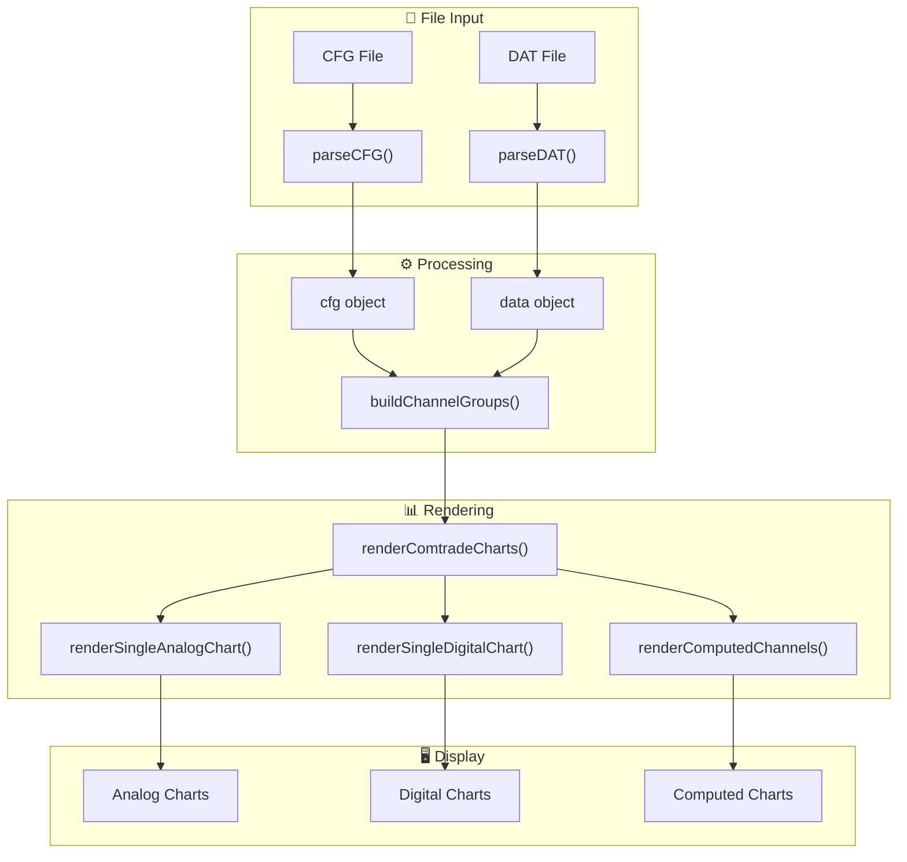

# COMTRADE Waveform Viewer

A high-performance, interactive waveform visualization tool for IEEE COMTRADE files used in power system protection and analysis.

## Features

- **COMTRADE File Support**: Parse and visualize IEEE C37.111 CFG/DAT files (ASCII and BINARY formats)
- **Interactive Charts**: High-performance uPlot-based waveform visualization
- **Channel Grouping**: Automatic and manual channel grouping (currents, voltages, digital signals)
- **Computed Channels**: Create custom calculated channels (RMS, harmonics, sequences)
- **Synchronized Cursors**: Linked cursor across all charts for time-aligned analysis
- **Vertical Line Markers**: Click to add measurement markers with delta calculations
- **Polar/Phasor Charts**: Real-time phasor visualization at any time point
- **Responsive Design**: Charts resize automatically with the viewport

## Quick Start

```bash
# Install dependencies
npm install

# Start development server
npm run dev

# Build for production
npm run build

# Generate documentation
npm run docs
```

## Usage

1. **Load Files**: Drag and drop COMTRADE CFG/DAT file pairs or use the file picker
2. **Navigate**: Use mouse wheel to zoom, drag to pan
3. **Measure**: Click on charts to add vertical line markers
4. **Analyze**: View delta values between markers in the delta window

## Project Structure

```
src/
├── components/           # UI Components
│   ├── renderSingleAnalogChart.js    # Analog chart renderer
│   ├── renderSingleDigitalChart.js   # Digital chart renderer
│   ├── renderComtradeCharts.js       # Chart orchestrator
│   ├── chartComponent.js             # uPlot options builder
│   └── ...
├── utils/                # Utility functions
│   ├── autoGroupChannels.js          # Channel grouping logic
│   ├── chartDomUtils.js              # DOM helpers
│   ├── chartInteractions.js          # Event handlers
│   └── ...
├── plugins/              # uPlot plugins
│   ├── verticalLinePlugin.js         # Vertical markers
│   ├── digitalFillPlugin.js          # Digital signal fill
│   └── ...
└── main.js               # Application entry point
```

## Architecture



## Key Concepts

### Channel Grouping

Channels are automatically grouped by pattern matching:
- **Currents**: IA, IB, IC, IN → Group G0
- **Voltages**: VA, VB, VC, VN → Group G1
- **Digital**: Grouped by signal type (SAG, SWELL, TRIP, etc.)

### Computed Channels

Create calculated channels with formulas:
- RMS calculations
- Sequence components (positive, negative, zero)
- Harmonic analysis
- Custom expressions

### Ownership Rule

Computed channels are rendered in the analog chart whose `groupId` matches the computed channel's `group` property.

## API Documentation

Generate full API documentation:

```bash
npm run docs
```

View documentation in `docs/` folder.

## Dependencies

- **[uPlot](https://github.com/leeoniya/uPlot)** - Fast, lightweight charting library
- **[Vite](https://vitejs.dev/)** - Next-generation frontend build tool
- **[Tailwind CSS](https://tailwindcss.com/)** - Utility-first CSS framework

## Browser Support

- Chrome 80+
- Firefox 75+
- Safari 13+
- Edge 80+

## License

MIT License

## Contributing

1. Fork the repository
2. Create a feature branch
3. Make your changes
4. Submit a pull request

---

Built with ❤️ for power system engineers
